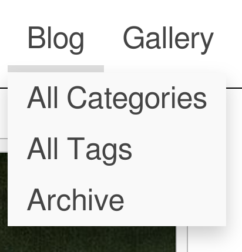

# Notrack

Notrack is an original, minimal theme with a focus on self-sufficiency and
decentralization. By default, Notrack does not rely on any third parties to
serve your website.

The README is long. You can use the automatic table of contents in GitHub to
navigate (upper right corner of rendered README).

## Dependencies

You will need the extended edition of Hugo in order to use this theme. This is
the edition Hugo's developers recommend for most users. You probably already
have it, but you can double check with:

```console
$ hugo version
hugo v0.115.4+extended linux/amd64 BuildDate=unknown
```

Note the "+extended" after the version number. Information about the standard
and extended versions may be found within Hugo's [installation
instructions](https://gohugo.io/installation/).

## Demonstration web page

The theme has a demonstration web page that looks like this:


There is a working demonstration page here: <https://gevhaz.github.io>

You can also run the demonstration web page on a local server. This is how you
do it:

```console
$ git clone https://github.com/gevhaz/hugo-theme-notrack notrack
$ cd notrack/exampleSite/
$ hugo server -D --themesDir ../..
```

You can them see the example website in your browser and interact with it. Hugo
will print instructions for what address to use. Usually it is
`http://localhost:1313/`.

## How to write a website from scratch with Notrack

There are two ways to get started with this theme – the bottom-up approach and
the top-down approach. The top-down approach is to just clone the example site
and modify it until it looks how you want. The bottom-up approach is to start
from scratch with `hugo new site` and gradually add the components you need.
This section explains how to do that.

### The basic structure

Notrack is built with a few types of pages in mind. The [home
page](#how-to-create-a-home-page) is mandatory, but the
[blog](#how-to-create-a-blog), ["About me"-page](#how-to-add-an-about-me-page),
[gallery](#how-to-create-a-gallery-page) and [resume](#how-to-create-a-resume)
are all optional.

This section deals with creating minimal version of each type of page the
theme supports. In the next section we will deal with adding custom content to
the pages using shortcodes (but you can of course use the default Hugo
shortcodes in any page as well).

#### How to create a home page

First, create a new Hugo project in a directory of your choice:

```console
$ hugo new site <my-webpage>
$ cd <my-webpage>
$ git init
$ git submodule add https://github.com/gevhaz/hugo-theme-notrack.git themes/notrack
```

> [!NOTE]
> I use angle brackets ('<' and '>') to indicate a placeholder. You should put
> replace it with your own value.

Your project should already have a file called `hugo.toml`. Open it and make
sure it looks something like this:

```toml
baseURL = '<URL where you plan to publicize your web page>'
languageCode = '<language code for language the website uses, e.g. en-us>'
title = '<My New Hugo Site>'
theme = 'notrack'

[params]
author = '<Your name>'
# optional, defaults to author:
siteHeading = '<the text that goes at the top of your webpage>'
```

Now you are ready to add the first content to the web page. Create the home
page, which is the first page users see:

```console
$ hugo new _index.md
```

This could contain a short introduction of what is on the website or of
yourself. Here is an example:

```markdown
+++
date = '2024-11-10T16:46:03+02:00'
title = ''
+++

Welcome to my web page!
```

Now you have a working website. You can run it locally with:

```console
$ hugo server
```

or deploy it somewhere according to the instructions form Hugo:
<https://gohugo.io/hosting-and-deployment/>

You can further extend the home page:

- Add an [image](#the-image-shortcode) (for example like in the demonstration
  web page)
- Add a [footer](#how-to-set-a-footer) (that will be shown on all pages)

#### How to create a blog

> TL;DR: You add blog posts the default way, but don't forget to add the blog
> section to the navigation bar so that people can find it.

First, create the mandatory `_index.md` page for the blog:

```console
$ hugo new blog/_index.md
```

And give it the following content:

```markdown
+++
title = '<no need to change>'
date = '<no need to change>'

[menu.main]
identifier = 'blog'
name = 'Blog'
weight = 5
+++
```

Under `[params]` in your `hugo.toml`, add:

```toml
mainSections = ['blog']
```

> [!NOTE]
> The section names are based on folder names, so if you call the folder
> something other than 'blog', make sure that that is reflected.

Add a blog post:

```console
$ hugo new blog/post-1.md
```

And put any content you want in it. Don't forget to set `draft` to `false`.

After adding or changing these three files, you will see a summary of the blog
post on the home page, and a link to the blog in the menu.

You can now continue blogging by just adding new posts with `hugo new blog/<post
name>.md`

For the blog, you may also be interested in:

- [How to create tags and categories
  pages](#how-to-create-tags-and-categories-pages)
- [How to create an archive page](#how-to-create-an-archive-page)

#### How to add an About Me page

There is nothing special about the About Me page, but the theme supplies a
couple of shortcodes that can be useful if you want to display social links like
in the demonstration site:


To prepare for using one of the shortcodes, configure your social media user
names like this in the site configuration:

```toml
[params.social]
github = '<your github username>'
email = '<email address>'
```

For all available social icons, see the
[`data/notrack/social.yaml`](https://github.com/gevhaz/hugo-theme-notrack/blob/master/data/notrack/social.yaml)
file. There are 65 of them.

Then, create a new page, for example like this:

```console
$ hugo new contact.md
```

Make sure you [add it to the navigation
bar](#how-to-add-a-page-to-the-navigation-bar), for example like this:

```toml
[menu.main]
name = 'About me'
weight = 90
```

Finally, use either the [`social`](#the-social-shortcode) or
[`contact-box`](#the-contact-box-shortcode) shortcodes in that page. The former
produces the element at the bottom of the above image, and the latter produces
the element on the right.

#### How to create a Gallery Page

A gallery page is just a normal page. Create a page:

```console
$ hugo new gallery.md
```

Then use the [gallery shortcodes](#the-gallery-shortcodes) on it.

#### How to create a resume

A resume page is just a normal page. Create a page:

```console
$ hugo new resume.md
```

Then use the [resume shortcodes](#the-resume-shortcodes) on it.

#### How to create tags and categories pages

If you have a blog, Hugo generates tags and categories pages for you
automatically. They are available at `<your-website.com>/tags` and
`<your-website.com>/categories` respectively. Don't forget to actually tag and
categorize your posts for them to show up there.

Notrack puts buttons at the top of your blog with links to the tags and
categories (and an archive page [if you have
one](#how-to-create-an-archive-page)). If you don't want these, disable it in
your site configuration:

```toml
[params]
showTaxonomyLinks = false
```

You might instead want to have a
[drop-down](#how-to-add-a-page-to-drop-down-menu) menu that links to tags and
categories, like this:



To add a tags page and a menu entry for it simply create a new `tags` section
and add its index page as a sub-menu to the blog. You create the section like
this:

```console
$ hugo new tags/_index.md
```

The only needed content is a menu definition in the front matter, like this:

```toml
[menu.main]
parent = 'blog'
name = 'Tags'
```

> [!IMPORTANT]
> Take care that the parent value is the _identifier_ of the blog menu that you
> have set in the blogs index page.

The procedure is exactly the same for categories.

#### How to create an archive page

You can add an Archive page that lists all blog posts by year and month. Do this
by adding a `[taxonomies]` section to your site configuration:

```toml
[taxonomies]
year = "year"
month = "month"
tags = "tags"
categories = "categories"
```

> [!NOTE]
> The `tags` and `categories` taxonomies are enabled by default but will be
> disabled when you add a taxonomies section to your site configuration unless
> you specifically add them.

Then add an archive page:

```console
$ hugo new archive/_index.md
```

It just needs to have a front matter specifying that it should have the
`archives` layout:

```toml
title = 'Archive'
layout = 'archives'
```

You will automatically get a button at the top of the blog page linking to the
archive unless you [disable it](#how-to-create-tags-and-categories-pages). You
might otherwise want to add the page to the Blog
[drop-down](#how-to-add-a-page-to-drop-down-menu) menu:

```toml
layout = 'archives'
[menu.main]
parent = 'blog'
name = 'Archive'
```

> [!IMPORTANT]
> Make sure the value of `parent` is the identifier you used for your blog menu
> entry or it won't show up in the drop-down.

### Shortcodes from Notrack

Notrack supplies a few custom shortcodes. In this section I present the list of
all the shortcodes in a table, and show how to use the non-trivial ones.

#### Shortcodes provided by Notrack

| Category          | Shortcode            | Description |
| :---              | :---                 | :---        |
| **Contact info**  | `contact-box`        | Displays contact info set in `params.social` |
|                   | `social`             | Displays contact info set in `params.social` |
| **Photo Gallery** | `gallery-category`   | Container for `gallery-photo` shortcodes |
|                   | `gallery-modal`      | HTML to allow for full page view of gallery photos |
|                   | `gallery-photo`      | Include a photo in a gallery |
|                   | `gallery-script`     | Script to allow for full page view of gallery photos |
| **General**       | `image`              | More advanced version of figure |
|                   | `video`              | Similar to an ordinary `<video>` HTML tag but with a CSS class to make it look good in posts       |
|                   | `rawhtml`            | For including raw HTML without the global unsafe option for Goldmark |
| **Resume**        | `container`          | Container for resume shortcodes |
|                   | `resume-entry`       | One entry in a resume (e.g. a university degree) |
|                   | `resume-section`     | One section in resume (e.g. "Education") |
|                   | `resume-subcategory` | Creates a heading within a section of the resume |

#### The raw HTML shortcode

`rawhtml` can be used like this:

```go
<p>A paragraph</p>
```

This allows you to use HTML to create elements that you can't create
with just markdown without allowing unsafe HTML in the site configuration file.
I'm not a security expert, and there might be a good reason why unsafe HTML
is disabled by default. If you think this shortcode shouldn't be part of
the theme, feel free to open an issue and say why.

#### The video shortcode

The `video` shortcode basically just creates a HTML `<video>` tag with a
class that I've added some styling for. Use it like this:

```go

```

Your video needs to be in the `static` folder or a subdirectory of it such
as "video" (in which case you'd add the subdirectory in the `src`
parameter.

#### The image shortcode

The `image` shortcode is for adding images, but provides a few more options than
Hugo's default `figure` shortcode. The following extra options are provided:

| Parameter name   | Allowed Values             |
| :---             | :---                       |
| `float`          | right/left                 |
| `frame`          | true/false/leave out       |
| `wide`           | true/false                 |
| `width`          | e.g. `10em`, `50%`, `70px` |
| `height`         | e.g. `10em`, `50%`, `70px` |

You can also use all the options for the
[`figure`](https://gohugo.io/content-management/shortcodes/#figure) shortcode.

Setting the `float` makes text wrap around the image, instead of it taking up
the full width of the page.

Here is an example of how to use it to add a picture to the home page:

```go

```

Make sure the `src` value points to an existing picture. In this case it
should be in `static/img/portrait.jpg`.

#### The contact-box shortcode

The `contact-box` shortcode creates a frame with links to your social media or
other contact info on the rights side of the page, and, if you want, some text
on the left side of the box, outside the frame. Put this text within the
shortcode tags.

What social media links are present in the frame is decided by the `social` key
of your site configuration. See [here](#how-to-add-an-about-me-page).

For `contact-box`, there are three optional parameters, `float`, `width`
and `height`. This is similar to the `image` shortcode. `Float` makes
text wrap around the box (can be `right` or `left`), and the other two
naturally set the dimensions of the `<div>`, using inline CSS. The
parameters defaults to floating to the right, the width defaults to
`12em`, and the height defaults to `auto`.

#### The social shortcode

This is similar to the `contact-box` shortcode. It just shows clickable icons
for your configured social media accounts. Like `contact-box`, the `social` key
of the site configuration is the source of what social media to include and what
your handles are.

#### The gallery shortcodes

There are four shortcodes for creating a gallery:

- `gallery-category`
- `gallery-photo`
- `gallery-modal`
- `gallery-script`

The first two are used in combination to create the actual gallery. Do
something like the following in one of your pages:

```go

    
    
    
    

```

The pictures should be under `static/img/thumbnails` in your project.

If you want a modal to pop up with a zoomed in version, add the other
two shortcodes at the bottom of your page:

```go


```

And place corresponding full-size images under `static/img/fullsize`.
The file names need to be the same as for the thumbnails.

Thumbnails should of course be small so that your page loads fast and
full-size should be large enough that they don't look pixelated when
covering the full space of a web browser. One way to resize images is
with [GraphicsMagick](http://www.graphicsmagick.org/): `gm mogrify
-resize 1920x1920 *.jpg`, which will resize all images in the current
folder to a maximum width/height of 1920 pixels (while maintaining the
aspect ratio).

#### The resume shortcodes

There are some shortcodes that can help you create a resume. These are:

- `container`
- `resume-section`
- `resume-category`
- `resume-entry`

`Container` just creates a `<div>` element with a specific class.
`resume-section` needs a title which will be shown to the left of it's content
(if it can fit on the screen, otherwise it's on top). Within this, you put one
or more `resume-entry` shortcodes. This shortcode takes the three parameters
`what`, `where` and `when` (see example usage below). It also takes raw HTML
within the shortcode tags. There is styling for `<p>`s, links, and unordered and
ordered lists. Apart from that, site-wide CSS is used. Example usage:

```go

    
        
            <p>
            Some info about you.
            </p>
        
    

    
        
            <ol>
                <li> Some comment on what skills you learned</li>
                <li> Some other comment </li>
            </ol>
        
    

```

A tip is that you can also use the `resume-entry` shortcode with markdown. Just
switch use % instead of < and make sure that your markdown doesn't have any
white space in front of it (or all of it will be interpreted as code):

```go
        {}
* Some comment on what skills you learned
* Some other comment
        {}
```

### Navigation bar

#### How to add a page to the navigation bar

Add it to `main` menu in the front matter of the page:

```toml
[menu.main]
identifier = 'contact'
name = 'About me'
weight = 90
```

Don't use the site configuration file to add menus because then the highlighting
of active tabs might not work (at least not if drop-down menus are involved).

#### How to add a page to drop-down menu

This theme has a navigation bar at the the top of all pages, with buttons like
"Home", "Blog", "About me", etc. depending on how you configure it. You can make
it so you get a drop-down menu when hovering over a button. An example is the
"Blog" button in the demonstration website.

If the button you want to use as the root of the drop down menu already exists,
you just need to set it as the parent of your page's menu entry. Your page's
front matter might look like this:

If your page is "About blog" and you want to add it to blog drop-down.

```toml
[menu.main]
parent = 'blog'
name = 'About blog'
```

You might want to have a button just for holding the drop-down menu. If so,
create a menu entry for a non-existent page in your site configuration:

```toml
[menu]
  [[menu.main]]
    identifier = "other"
    name = "Other"
    pageRef = '#'
    weight = 30
```

The lower the weight, the further to the left in the navigation bar the entry
goes. A `pageRef` of '#' makes it so that pressing the button doesn't change the
page.

Now that you have created a dummy menu entry, you can add your real page to it
just like before by referencing it as a parent:

```toml
[menu.main]
parent = 'other'
name = 'My links'
```

### Other site configuration

#### How to set a footer

If you want to add a footer to your web page, you can use the `footer` key in
your configuration, e.g:

```toml
[params]
footer = """\
  This work is licensed under a Creative Commons Attribution-ShareAlike 4.0 \
  International License.\
  """
```

This will add a HTML <footer> element with a <span> element with your text in
it.

#### How to disable or customize home page blog summary

By default, the theme provides a summaries of the three latest blog posts on the
home page if you have a blog. If you don't want that, set `showBlogLatest` to
false in your site configuration file. You may also want to change the number of
posts shown and the heading above it (default "Latest from the blog") In
`hugo.toml`, it would look like this:

```toml
[params]
showBlogLatest = true
blogLatestHeading = 'Latests posts'
nBlogLatest = 6
```

#### Adding comments to blog

For backward-compatibility, it is still possible to enable Disqus comments.
However, I advise against it due to the privacy issues for your users, see the
[Disqus Wikipedia
article](https://en.wikipedia.org/wiki/Disqus#Criticism,_privacy,_and_security_concerns).

Disqus is implemented the [default Hugo
way](https://gohugo.io/content-management/comments/#add-disqus) so just add your
Disqus Shortname in the site configuration file and all blog posts will have a
comments section.

## Acknowledgements and attributions

The theme does not secretly download any resources from other websites or CDNs.
It does, however, make use of a few other projects. These are included in the
theme files, so you'll homepage will serve the resources.

Some of the fonts under `static/fonts` are parts of the project [GNU
FreeFont](https://www.gnu.org/software/freefont/). They are licensed under
"GPLv3 or later". Licenses are also supposed to be included in the `.woff` files
themselves. Some of the fonts are edited by me to take up less space by
including fewer characters.

The monospace font in the same directory, used for code in the theme, is
[Mononoki](https://github.com/madmalik/mononoki). It is licensed under SIL OFL
1.1 ([https://scripts.sil.org/OFL](https://scripts.sil.org/OFL)).

The icons used for the `contact-box` and `social` shortcodes are from [Font
Awesome](https://github.com/FortAwesome/Font-Awesome) project. It's license is
SIL OFL 1.1 ([https://scripts.sil.org/OFL](https://scripts.sil.org/OFL)). A HTML
comment is included in the contact-box shortcode to show the license and source.

For matching the icons from Font Awesome with names for various social
networking services, I use the
[`social.yml`](https://github.com/dillonzq/LoveIt/blob/master/assets/data/social.yml)
file from the [LoveIt](https://github.com/dillonzq/LoveIt) theme, which uses the
MIT license. I modified it to use the *Font Awesome Solid* font for the email
icon, because the one in the original file was using the *Font Awesome Regular*
font, which it seems only Pro users of Font Awesome [can
use](https://fontawesome.com/plans). The solid one also looks better.

All of the images in the example site are in the public domain.

## Contributing

If you find a bug, please [open an
issue](https://github.com/gevhaz/hugo-theme-notrack/issues/new/choose).

If some change could be made or something could be added that is in line with
the style and philosophy of the theme, and it doesn't break anything, feel free
to make a pull request.

## FAQ

### Q: How do I update the theme?

`cd` to it and do a `git pull`.

### Q: I would like to change the CSS styling of the site looks

You can add your own CSS by creating a file `assets/css/userstyles.css`. The
theme will automatically pick it up.

### Q: My pages don't show up on the site

Have you removed `draft = true`? Have you [added the page to a
menu](#how-to-add-a-page-to-the-navigation-bar)? Also try restarting `hugo
server`.
